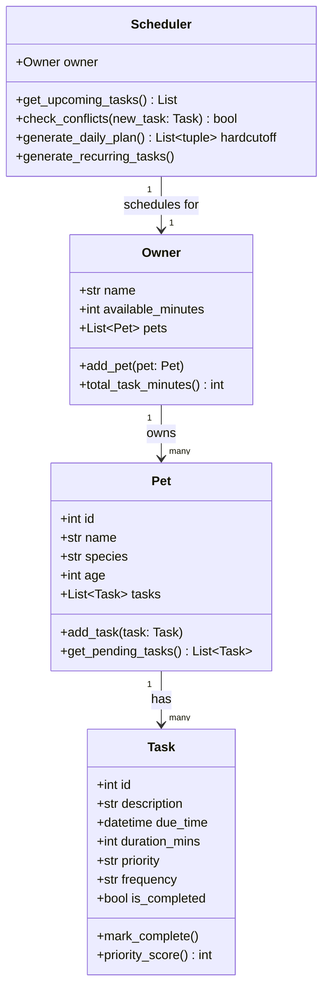

# PawPal+ Class Diagram

```mermaid
classDiagram
    class Owner {
        +str name
        +int available_minutes
        +List~Pet~ pets
        +add_pet(pet: Pet)
        +total_task_minutes() int
    }

    class Pet {
        +int id
        +str name
        +str species
        +int age
        +List~Task~ tasks
        +add_task(task: Task)
        +get_pending_tasks() List~Task~
    }

    class Task {
        +int id
        +str description
        +datetime due_time
        +int duration_mins
        +str priority
        +str frequency
        +bool is_completed
        +mark_complete()
        +priority_score() int
    }

    class Scheduler {
        +Owner owner
        +get_upcoming_tasks() List
        +check_conflicts(new_task: Task) bool
        +generate_daily_plan() List~tuple~ hardcutoff
        +generate_recurring_tasks()
    }

    Owner "1" --> "many" Pet : owns
    Pet "1" --> "many" Task : has
    Scheduler "1" --> "1" Owner : schedules for
```